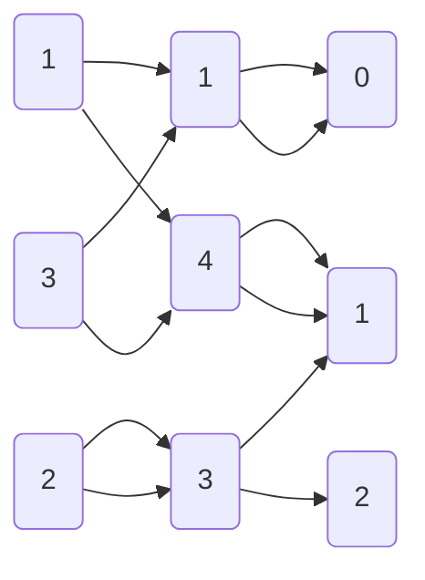

import { Callout } from 'nextra/components'

# Lecture 9: Relations

Based on [Discrete Mathematics and Its Applications](https://www.amazon.com/Discrete-Mathematics-Applications-Kenneth-Rosen/dp/0072899050) by Kenneth H. Rosen, 7th Edition.

---

Hubungan antara dua objek dapat direpresentasikan secara langsung dengan menggunakan pasangan berurutan (ordered pair).

<Callout type="info">
Anggap $A$ dan $B$ adalah dua himpunan. Hubungan biner $R$ dari $A$ ke $B$ adalah himpunan bagian dari $A \times B$.
</Callout>

Dalam kata lain, hubungan biner $A \rightarrow B$ didefinisikan dengan

$$
(\underbrace{a}_{\text{dari $A$}}, \underbrace{b}_{\text{dari $B$}}) \in R \iff aRb
$$

> **Contoh:**
> - Misalkan $A = \{1, 2, 3\}$ dan $B = \{a, b\}$. 
> - $A \times B = \{(1, a), (1, b), (2, a), (2, b), (3, a), (3, b)\}$.
> - Misalkan $C = \{(1, a), (2, a), (3, b)\}$
> - Karena $C \in (A \times B)$, maka $C$ adalah hubungan biner dari $A$ ke $B$.

Himpunan $C$ dapat direpresentasikan dengan tabel berikut:

| $C$ | $a$ | $b$ |
| --- | --- | --- |
| $1$ | $\checkmark$ | |
| $2$ | $\checkmark$ | |
| $3$ | | $\checkmark$ |

## Relasi Fungsi

Bila kita mengingat definisi fungsi, maka fungsi adalah suatu yang memetakan tepat sekali antara domain ke range. Namun, relasi dapat memetakan domain ke banyak range.

$$
(a, f(a)) \text{ for } a \in A
$$

## Relasi dalam Himpunan

<Callout type="info">
Relasi dalam himpunan $A$ adalah relasi dari $A$ ke $A$
</Callout>

dalam kata lain, relasi dalam set $A$ adalah subset $A \times A$

> **Berapakah relasi yang mungkin terjadi dalam himpunan dengan $n$ elemen?**

Relasi dalam set $A$ adalah relasi terhadap dirinya sendiri. Jika $A$ memiliki $n$ elemen, maka elemen $A \times A$ adalah $n^2$. Subset dari suatu himpunan adalah $2^m$ untuk $m$ jumlah elemen. Sehingga terdapat $2^{(n^2)}$ relasi berbeda untuk $n$ elemen.

## Properti Relasi

Misalkan ada beberapa relasi dari himpunan $A = \{1, 2, 3, 4 \}$:

$$
\begin{align*}
R_1 &= \{(1, 1), (1, 2), (2, 1), (2, 2), (3, 4), (4, 1), (4, 4)\} \\
R_2 &= \{(1, 1), (1, 2), (2, 1)\} \\
R_3 &= \{(1, 1), (1, 2), (1, 4), (2, 1), (2, 2), (3, 3), (4, 1), (4, 4)\}\\
R_4 &= \{(2, 1), (3, 1), (3, 2), (4, 1), (4, 2), (4, 3)\}
\end{align*}
$$

Serta relasi dari himpunan $B = \{a, b\}$ untuk $(a, b) \in \mathbb{Z}$:

$$
\begin{align*}
R_5 &= \{(a,b) \mid a \leq b \}\\
R_6 &= \{(a,b) \mid a > b \}\\
R_7 &= \{(a,b) \mid a = b \}\\
R_8 &= \{(a,b) \mid a \neq b \}\\
R_9 &= \{(a,b) \mid a + b \leq 3 \}
\end{align*}
$$

### Refleksif

<Callout type="info">
Relasi $R$ pada himpunan $A$ dikatakan refleksif jika $(a, a) \in R$ untuk setiap $a \in A$.
</Callout>

Dalam kata lain, **setiap elemen $a$ dari himpunan $A$** harus berhubungan dengan dirinya sendiri.

$$
\forall a ((a, a) \in R)
$$

Negasi dari refleksif adalah:

$$
\exists a ((a, a) \notin R)
$$

#### Example

Manakah dari relasi $R_1, R_2, R_3, R_4$ yang refleksif?

- $R_1$ tidak refleksif karena $(3, 3) \notin R_1$
- $R_2$ tidak refleksif karena $(2, 2) \notin R_2$
- $R_3$ refleksif karena $(1, 1), (2, 2), (3, 3), (4, 4) \in R_3$
- $R_4$ tidak refleksif karena $(1, 1) \notin R_4$

### Simetris

<Callout type="info">
Relasi $R$ pada himpunan $A$ dikatakan simetris jika $(a, b) \in R \implies (b, a) \in R$ untuk setiap $a, b \in A$.
</Callout>

Analogikan dengan jabat tangan. Jika $a$ berjabat tangan dengan $b$, maka $b$ juga **pasti** berjabat tangan dengan $a$.

$$
\forall a \forall b ((a, b) \in R \implies (b, a) \in R)
$$

Negasi dari simetris adalah:

$$
\exists a \exists b ((a, b) \in R \land (b, a) \notin R)
$$

#### Example

Manakah dari relasi $R_1, R_2, R_3, R_4$ yang simetris?

- $R_1$ tidak simetris karena $(3, 4) \in R_1$ tetapi $(4, 3) \notin R_1$
- $R_2$ simetris karena $(1, 2), (2, 1) \in R_2$
- $R_3$ simetris
- $R_4$ tidak simetris karena $(2, 1) \in R_4$ tetapi $(1, 2) \notin R_4$

### Antisimetris

<Callout type="info">
Relasi $R$ pada himpunan $A$ dikatakan antisimetris jika $(a, b) \in R \land (b, a) \in R \implies a = b$ untuk setiap $a, b \in A$.
</Callout>

Dalam artian lain, $(a, b) \in R$ dan $(b, a) \in R$ hanya terjadi jika $a = b$.

$$
\forall a \forall b ((a, b) \in R \land (b, a) \in R \implies a = b)
$$

Negasi dari antisimetris adalah:

$$
\exists a \exists b ((a, b) \in R \land (b, a) \in R \land a \neq b)
$$

#### Example

Manakah dari relasi $R_1, \cdots, R_9$ yang antisimetris?

- $R_4$ antisimetris karena tidak terdapat $a, b$ dengan $a \neq b$ yang memenuhi $(a, b), (b, a) \in R_4$.
- $R_5$ antisimetris karena semua pasangan $(a, b), (b, a)$ yang memenuhi $a \leq b$ juga memenuhi $b \leq a$ $(a=b)$.
- $R_6$ antisimetris karena $a > b$ tidak memenuhi $b > a$.
- $R_7$ antisimetris karena $(a, b), (b, a) \in R_7$ selalu memenuhi $a = b$.
- $R_8$ antisimetris
- $R_9$ tidak antisimetris karena $(1, 2), (2, 1) \in R_9$ tetapi $1 \neq 2$.

### Transitif

<Callout type="info">
Relasi $R$ pada himpunan $A$ dikatakan transitif jika $(a, b) \in R \land (b, c) \in R \implies (a, c) \in R$ untuk setiap $a, b, c \in A$.
</Callout>

<Callout type="warning">
Misalkan ada relasi $R = \{(1, 2), (2, 1), (1, 1)\}$. Relasi ini **tidak transitif** karena $(1, 2), (2, 1) \in R \implies (1, 1) \in R$ tetapi $(2, 2) \notin R$.
</Callout>

#### Example

Manakah dari relasi $R_1, \cdots, R_9$ yang transitif?

- $R_1$ tidak transitif karena terdapat $(3, 4) \land (4, 1) \in R_1$ tetapi $(3, 1) \notin R_1$.
- $R_2$ tidak transitif karena $(1, 2), (2, 1) \in R_2$ tetapi $(2, 2) \notin R_2$.
- $R_3$ tidak transitif karena $(4, 1) \land (1, 2) \in R_3$ tetapi $(4, 2) \notin R_3$.
- $R_4$ transitif karena tidak terdapat $(a, b), (b, c) \in R_4$ yang memenuhi $(a, c) \notin R_4$.
- $R_5$ transitif. Misalkan $(a, b), (b, c) \in R_5$. Karena $a \leq b$ dan $b \leq c$, maka $a \leq c$.
- $R_6$ transitif. Misalkan $(a, b), (b, c) \in R_6$. Karena $a > b$ dan $b > c$, maka $a > c$.
- $R_7$ transitif. Misalkan $(a, b), (b, c) \in R_7$. Karena $a = b$ dan $b = c$, maka $a = c$.
- $R_8$ tidak transitif. Misalkan $(1, 2) \land (2, 1) \in R_8$ tetapi $(1, 1) \notin R_8$.
- $R_9$ transitif. Misalkan $(a, b), (b, c) \in R_9$. Karena $a + b \leq 3$ dan $b + c \leq 3$, maka $a + c \leq 3$.

## Kombinasi Relasi

<Callout type="info">
Relasi dapat dioperasikan selayaknya operasi himpunan.
</Callout>

#### Example

Misalkan $R_1 = \{(x,y) | x < y\}$ dan $R_2 = \{(x,y) | x > y\}$. Tentukan:

1. $R_1 \cup R_2$ kondisi tersebut mensyaratkan relasi yang memenuhi $x < y$ atau $x > y$. Sehingga $R_1 \cup R_2 = \{(x,y) | x \neq y\}$
2. $R_1 \cap R_2$ kondisi tersebut mensyaratkan relasi yang memenuhi $x < y$ dan $x > y$. Sehingga $R_1 \cap R_2 = \emptyset$
3. $R_1 - R_2$ karena $R_1$ tidak memiliki anggota yang sama dengan $R_2$, maka $R_1 - R_2 = R_1$
4. $R_2 - R_1 = R_2$ dengan alasan seperti di atas
5. $R_1 \oplus R_2$ kondisi tersebut mensyaratkan relasi yang memenuhi $x < y$ atau $x > y$ tetapi tidak keduanya. Sehingga $R_1 \oplus R_2 = \{(x,y) | x \neq y\}$

### Komposisi Relasi

<Callout type="info">
Komposisi relasi $R$ dan $S$ adalah relasi $T$ yang memenuhi $(a, c) \in T \iff \exists b ((a, b) \in R \land (b, c) \in S)$. Dinotasikan dengan $S \circ R$.
</Callout>

Dalam artian lain $(a, b) \in (S \circ R)$ memiliki semua komponen pertama dari $R$ sebagai $a$ dan semua komponen tersambung dari komponent pertama $R$ ke komponen kedua $S$ sebagai $b$.

#### Example

Misalkan

$$
R = \{(1, 1), (1,4), (2,3), (3,1), (3, 4)\}
$$ 

$$
S = \{(1, 0), (2,0), (3,1),(3,2),(4,1)\}
$$

Tentukan $S \circ R$.

$$
S \circ R = \{(1, 0), (1, 1), (2, 1), (2, 2), (3, 0), (3, 1)\}
$$

### Komposisi Relasi dengan Dirinya Sendiri

<Callout type="info">
Komposisi relasi $R$ dengan dirinya sendiri adalah relasi $R^n$ yang memenuhi $(a, c) \in R^n \iff \exists b_1, b_2, \cdots, b_{n-1} ((a, b_1) \in R \land (b_1, b_2) \in R \land \cdots \land (b_{n-1}, c) \in R)$. Dinotasikan dengan $R^n$.
</Callout>

Didefinisikan pula secara rekursif sebagai:

$$
R^n = 
\begin{cases}
R & \text{jika } n = 1 \\
R^{n-1} \circ R & \text{jika } n > 1
\end{cases}
$$

Dapat disimpulkan pula bahwa

<Callout type="info">
Relasi $R$ dalam himpunan $A$ transitif jika dan hanya jika $R^n \subseteq R$ untuk setiap $n \in \mathbb{Z}^+$.
</Callout>

## Exercise

Determine whether the relation R on the set of all Web
pages is reflexive, symmetric, antisymmetric, and/or transitive, where $(a, b) ∈ R$ if and only if:
1. everyone who has visited Web page a has also visited
Web page b.
2. there are no common links found on both Web
page a and Web page b.
3. there is at least one common link on Web page a and
Web page b.
4. there is a Web page that includes links to both Web
page a and Web page b.